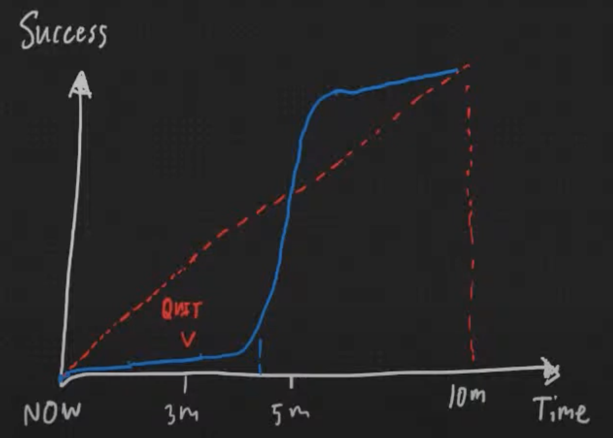
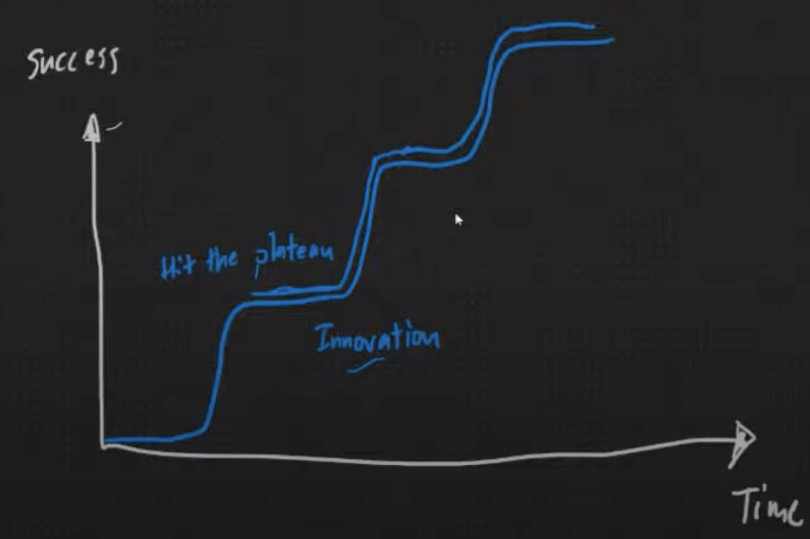

# Day1

## Topic: Learn English in the right way

### 3 things keep that in mind.
    1.You learnign something because you want to get better at that thing
    2.Leaning curve suck!, don't lose motivation
    3.Change every thing around you in Englist

## Learning curve

learning English is a S curve not a linear

At start your improvement to grow slowly, It's take "time" for raise up -> "DON'T LOSE MOTIVATION"

but in the real world S curve have many a little bit of s curve and when you raise up and hit plateau, you need to innovation your learning like a lift weight

### Words
    whether: (conj / prep) ไม่ว่า
    also: (adv)ด้วย
    so: (adv)ดังนั้น
    faculty: (n)คณะ
    through: (adv)ผ่าน
    wonder: (v)แปลกใจ
    proprably: (adv)อาจ / อาจจะ
    quite: (adv)ค่อนข้าง
    granted: (adj)ได้รับ
    sudden: (adj)กระทันหัน
    overwhelming: (adj)ล้นหลาม
    purpose: (v)วัตถุประสงต์
    motivation: (n)แรงกระตุ้น
    innovation: (n)นวัฒกรรม / เปลี่ยนแปลง / ปรับปปรุง
    either: (adj)ทั้ง / ทุก
    fleuntly: (adv)คล่องแคล่ว / ฉะฉาน
    precisly: (adv)แม่นยำ
    convince: (v)โน้มน้าว / ทำให้เชื่อ

### pPhrases
    for those of you: สำหรับใคร 
    would love to ... : อยากที่จะ ...
    let me know: บอกให้รู้ที
    that not a big deal: มันไม่ใช่เรื่องใหญ่
    chunk of time: ช่วงเวลา
    by the time: ตลอดเวลา
    hang on tight: ถือสายไว้ / อย่าเพิ่งไปไหน
    don't know what to do: ไม่รู้ว่าจะทำอย่างไรละ
    that was i meant: นั้นแหละที่ฉันหมายถึง
    main purpose: วัตถุประสงค์หลัก
    let's say after me: พูดตามฉัน
    so what: แล้วไงต่อ
    make a wild gruess: เดามั่ว
    keep that in mind: โปรดจำไว้ว่า
    not only ... but also: ไม่เพียง ... แต่ยัง...
---    
    You are not good at "someThing" is because you actually don't want to be better

    strong point somewhere but also weakness everywhere else