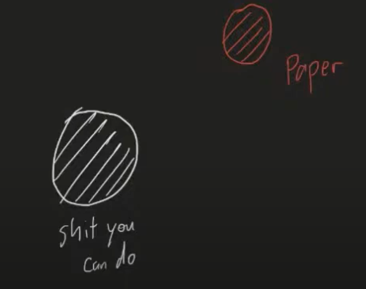
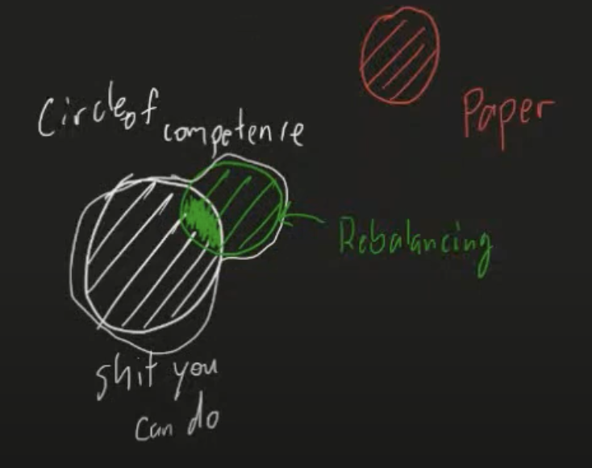
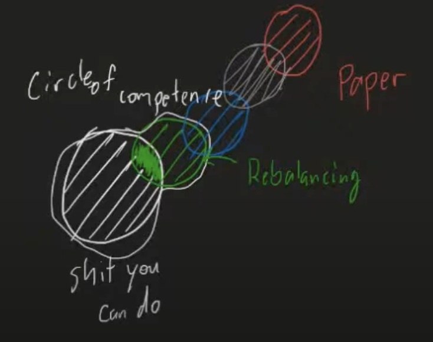

# Day3

## Topic: How to get better at **reading** with 3 aspect skill (P,F,I)

### **Reading with Fluidity**
  Fluidity is basically how fast & how natural to do something

  - Don't get bogged down by vocabulary, enjoy your elading as a whole

  - Expand your "Circle Of Competence" realistically

        when you read the same thing multiple times end up reading the same thing multiple times -> that mean it's too diffical, change down the article that you can under stand and follow the "Circle Of Competence" 

"Circle Of Competence" 

At start: Too difficult article (read multiple times but you are not understand) 

Down your reading to the article that make you understand

Move the step with the harder article 

---
### **Reading with Precision**
- Read the right level

if you read wrong level it doesn't matter, what you try to read doesn't matter what topic try to read

- Coming to terms with author
---
### **Reading with Intonation**
- Read a lot -> read everything
- Copy,the steal
---
    Make sure you know your piority.

### Words
    whole: (adj)ทั้งหมด
    expand: (v)ขยาย / พัฒนา
    competence: (n)ความรู้ ความสามารถ
    jealous: (adj)อิจฉา
    vocabulary: (n)คำศัพท์
    discouraged: (adj)ท้อแท้ / หมดใจ
    complain: (v)บ่น
    surreptitiously: (adj)อย่างลับๆ
    doubt: (v)สงสัย 
    context: (n)บริบท
    surrounding: (adj)โดยรอบ 
    bogged: (v)จม
    recommandation: (n)คำแนะนำ
    concerned: (adj)เกี่ยวข้อง 
    excuse: (v)ขอโทษ / แก้ตัว
    announcing: (n)การประกาศ
    at least
    infinitely
    condensation
    insanity: (n)จิกลจริต
    expect: (v)คาดหวัง
    apporach: (v/n)แนวทาง
    expressing: (n)การแสดงออก
    excess: (adj)ส่วนเกิน
    negotiation: (n)เจรจาต่อรอง
    article: (n)บทความ

### Phrases
    How are you doing?: คุณเป็นอย่างไรบ้าง
    on the other hand: ในทางกลับกัน / ทาตรงกันข้าม
    at least: อย่างน้อย
    In order to be to <verb>: 

---    
   Don't worry too much about word that you don't know, keep reading full paragraph end.

    Doing samething over and over again and expect different result